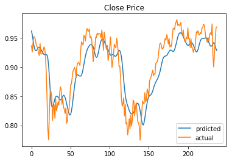
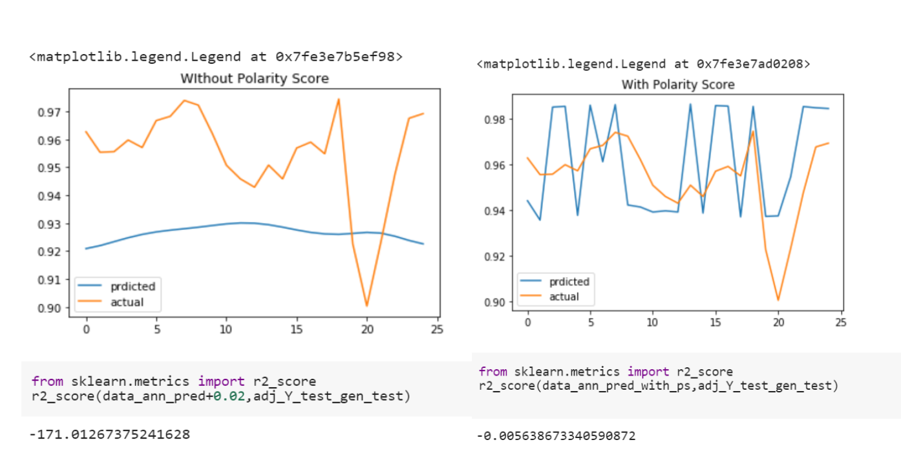

# stock-prediction-using-sentimental-analysis
ANALYSIS ON EFFECTS OF NEWS SENTIMENTS ON STOCK PREDICTIONS  
    
Our project is based on the Natural Language Processing technique called Sentiment Analysis. In this project we chose as stock market and news related to it as our subject of analysis. The abstract of this project is that, we collected news related data for a period of time, and parallelly collected data related to stocks of that period. From the news data, we did an analysis of its polarity, of being positive or negative. And based on that polarity we observed change in daily market because of the news, which earlier wasn’t visible just on the basis of stock data that was fed to the algorithm.  
Data: 
Our model comprised of two parts. One was of sentimental analysis and another model was to see its impact on stock market, which was done by a module that comprised of LSTM algorithm and ANN network. The data collection process for both of them were as follows. 
•	For the first model, news data was to be collected. Our first attempt to this was using Twitter tweets data, which we reckoned to collect in a live fashion. For that purpose, we had to use the Twitter API, but since we couldn’t get permission from the site in due time, we didn’t go ahead with it. Next, we aimed at going with news from the world wide web and used another API known as NewsAPI. But we had to drop this as well, the hurdle being, availability of news content through the api. After scrambling the web a little, we found Reddit news data being readily available. And hence our final checkpoint in gathering the data was at Reddit news data. For this process we had to create a “News Extraction” module from scratch in python (attached in the project files). Our final news related data was top 25 news of the day for a period spanning over about 8 years (1989 days) available on Reddit. 
•	For the other part of data gathering, we had to collect stock related data. Initially it was decided to go with a particular company’s stock data, Reliance Industries Limited to name the one. But since our attempt to collect news from NewsAPI ended in a truffle we resorted to DJIA(Dow Jones Industrial Average) data that was collected through Yahoo Finance. This data comprised of Opening, Closing, High and Low, with that Adjusted Closing price, which is the parameter which actually gets affected by the news of everyday.  
 
 without sentimental analysis Prediction Model----->
 
 
 

Sentimental Analysis Model:
For this model we chose to go with a rule-based(lexicon based) model. The reason for choosing this kind of a model was that, news data has words that depend on the context, and can be quite unpredictable. Hence the model needs to be constantly updated of the new words(tokens) that come into picture so as to adapt to the evolvement of the model. The model worked as follows.  
•	For preprocessing part, the news data was as follows: 
The top 25 news were in different documents. But the data was labelled for the entire day as positive or negative. Hence, we combined the entirety of 25 news in one document. Now we had one document for each day. In totality, we had 1989x25 news documents, and after processing we had 1989x1 news documents. 
 
•	Now, for training, a part of the data was passed through a frequency classifier function, TFIDFVectorizer. This function basically assigns a frequency value to the different tokens present in the entire corpus, as to it appearing in a positive or a negative document of the corpus. With this the preprocessing of the data was done. 
•	A Deep Neural Network was created to pass on the processed frequencies of each token in each document present in the corpus so as to train the DNN to recognize the weightage of the document (probability) of being either positive or negative. This comprised the training part of this module. 
  
•	For testing the part of the data that was unseen to the model was passed on, again ran through the preprocessing steps, and afterwards was passed to the DNN model. The task of the DNN model was to give as output the probability and hence the polarity of the sentence(document) as to being positive or negative, and how positive or negative it relatively is to other news documents the model has yet seen. 
 
Stock Prediction Model: 
This model had three parameters as input, namely, Opening Price, Closing Price and Polarity Score (which was predicted by earlier model). Our main goal was, quantified analysis of stock prediction, with and without the use of sentimental data related to news. This was done through use of different LSTM models and an ANN network which took as parameters, the values predicted by the LSTM models. The steps are as follows: 
•	The input given to the model was the past 60 days Opening and Closing price to predict the upcoming values of the respective, this data was predicted using two different LSTM models. 
•	Sentiment data (scaled and unscaled) were passed on after prediction from previous model.  
•	For the ANN portion, the ANN had two different structures which were as follows: One of them just had opening and closing price of the day as parameters and another one had, along with preceding two, sentiment polarity as well. 
  
•	These two models were run and their performances were compared. 
  
Difference in r2_score before and after intoduction of polarity score of news sentiment 

 
The comparitive results of both the models were found to be significantly differing in terms of variation of everyday price. The basic prediction task of the model is to show the significant change in the market, i.e, the relative ups and downs of market in everyday trading. There can be seen a very clear improvement in root-mean-square error of the model with introduction of the sentiment factor. Without the sentiment data, the predictions hardly show much variation, and hence if, for real stock, we wanted to do after hour trading, we wouldn’t actually know what the market variation is. But knowing the variation, we would stand somewhere in terms of knowledge of market going high or low. 
